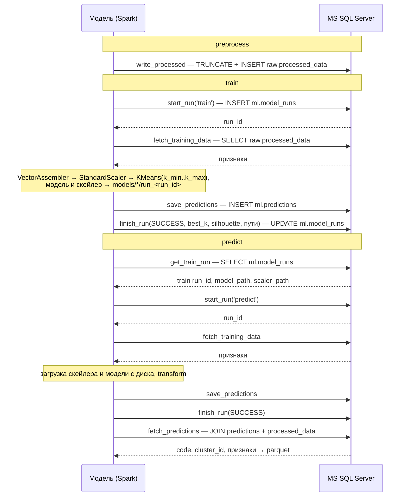

# Lab 6: PySpark KMeans на Open Food Facts + MS SQL Server

Кластеризация продуктов Open Food Facts по пищевой ценности (на 100г) с помощью Spark ML KMeans.
Очищенные данные, журнал запусков и предсказания хранятся в MS SQL Server; модель работает с базой
через Spark JDBC и `pymssql`.

## Установка

Секреты для базы — в `.env` в корне проекта:

```bash
cp .env.example .env
```

Положите сырой датасет в `data/en.openfoodfacts.org.products.csv` (путь задаётся в `src/config.json` → `data.raw_path`).

### Через Docker

```bash
docker compose up -d mssql mssql-init
```

`mssql-init` прогоняет [`docker/mssql/init/schema.sql`](docker/mssql/init/schema.sql) — скрипт идемпотентен,
повторный запуск на существующей базе безопасен. Данные базы лежат в volume `mssql-data` и переживают
`docker compose down` (удалить: `docker compose down -v`).

### Локально

Нужна Java (Spark — JVM-приложение) и поднятый контейнер `mssql`:

```bash
brew install openjdk@17
export JAVA_HOME=/opt/homebrew/opt/openjdk@17

python3 -m venv .venv
source .venv/bin/activate
pip install -r requirements.txt

set -a; source .env; set +a
```

## Конфигурация

Все настройки — в [`src/config.json`](src/config.json): пути к данным/артефактам (`data`), какие колонки брать (`features`),
как считается размер сэмпла (`sampling`), параметры модели (`model`, включая диапазон `k`), подключение к базе (`datasource`).
Ресурсы машины (ядра, RAM) не задаются вручную — определяются в рантайме (`src/spark_session.py`), конфиг лишь ограничивает,
сколько от них брать.

Переменные окружения важнее конфига: `MSSQL_HOST` / `MSSQL_PORT` переопределяют `datasource.host` / `datasource.port`, `MSSQL_USER` / `MSSQL_PASSWORD` обязательны.

## Запуск

```bash
# 1. Предобработка: сырой CSV -> отбор колонок -> очистка -> сэмпл -> raw.processed_data
docker compose run --rm app preprocess

# 2. Обучение: подбор k по silhouette, модель/скейлер на диск, предсказания и метрики в базу
docker compose run --rm app train

# 3. Инференс моделью последнего успешного обучения
docker compose run --rm app predict --output data/processed/predictions.parquet
```

Локально те же команды: `python src/main.py preprocess|train|predict`.

Результаты:
- `raw.processed_data` — очищенная выборка признаков
- `ml.model_runs` — журнал запусков со статусом, метриками и путями к артефактам
- `ml.predictions` — номер кластера для каждого продукта в разрезе запуска
- `models/kmeans/run_<run_id>`, `models/scaler/run_<run_id>` — обученные артефакты
- `reports/preprocess_report.json` — сколько строк отсеялось на каждом шаге очистки
- `data/processed/predictions.parquet` — выгрузка предсказаний `predict` вместе с признаками

## Протокол взаимодействия между моделью и источником данных

**Кто участвует.** Модель на Spark. Источник данных — база MS SQL Server.
Модель всегда начинает первой: сама забирает данные и сама отправляет результаты. База только отвечает.

**Как подключаемся.** По сети на порт 1433, логин и пароль берутся из переменных `MSSQL_USER` и `MSSQL_PASSWORD`.
Весь код работы с базой находится в [`src/datasource.py`](src/datasource.py):
- большие объёмы данных (сотни тысяч строк) читаются и пишутся через Spark JDBC;
- короткие служебные запросы в одну строку идут через библиотеку `pymssql`.

**Запуск.** Каждый вызов `train` или `predict` записывается в базу отдельной строкой с номером `run_id`.
Номер выдаёт сама база. Все результаты помечаются этим номером, поэтому разные запуски не перемешиваются.

### Обучение (`train`)

1. **Регистрация.** Модель сообщает базе, что начинает обучение. База создаёт запись со статусом `RUNNING` и возвращает `run_id`.
2. **Выгрузка данных.** Модель забирает признаки товаров из таблицы `raw.processed_data`.
3. **Обучение.** Модель подбирает число кластеров и обучается. Обученная модель сохраняется на диск в папку `models/`.
4. **Загрузка результатов.** Модель записывает в таблицу `ml.predictions` номер кластера для каждого товара.
5. **Завершение.** Модель ставит статус `SUCCESS` и записывает метрики: число кластеров и оценку качества.

Если на любом шаге произошла ошибка, запуск получает статус `FAILED`, а текст ошибки сохраняется в базе.

### Предсказание (`predict`)

Порядок тот же, но вместо обучения:
- модель сначала спрашивает у базы, какое обучение было последним успешным и где на диске лежит его модель;
- загружает эту модель и применяет её к данным;
- после записи результатов читает их обратно из базы и сохраняет в parquet-файл.

### Предобработка (`preprocess`)

Подготовительный шаг перед работой модели: читает исходный CSV, очищает данные
и записывает их в `raw.processed_data`. Прежнее содержимое таблицы заменяется.

### Схема



## Формат хранения данных

Все таблицы создаёт скрипт [`docker/mssql/init/schema.sql`](docker/mssql/init/schema.sql).
Таблицы разделены на две группы: `raw` — данные, которые модель получает, `ml` — то, что модель выдаёт.

### `raw.processed_data` — данные для модели

Одна строка — один товар.

| Колонка | Что хранит |
|---|---|
| `product_id` | порядковый номер строки, проставляет база |
| `code` | штрихкод товара |
| `energy_kcal_100g`, `fat_100g`, `saturated_fat_100g`, `carbohydrates_100g`, `sugars_100g`, `proteins_100g`, `salt_100g` | 7 признаков на 100 г: калории, жиры, насыщенные жиры, углеводы, сахар, белки, соль |

### `ml.model_runs` — журнал запусков

Одна строка — один запуск `train` или `predict`.

| Колонка | Что хранит |
|---|---|
| `run_id` | номер запуска, проставляет база |
| `command` | `train` или `predict` |
| `status` | `RUNNING`, `SUCCESS` или `FAILED` |
| `started_at`, `finished_at` | время начала и окончания |
| `rows_in` | сколько строк модель получила из базы |
| `best_k`, `best_silhouette` | число кластеров и оценка качества кластеризации |
| `params` | остальные параметры в формате JSON, например путь к модели |
| `scaler_path` | где на диске лежит скейлер |
| `error_message` | текст ошибки, если запуск упал |

### `ml.predictions` — результаты модели

Одна строка — один товар в одном запуске.

| Колонка | Что хранит |
|---|---|
| `run_id` | в каком запуске получен результат |
| `code` | штрихкод товара |
| `cluster_id` | номер кластера |

В одном запуске у товара ровно один кластер: пара `run_id` + `code` не может повторяться.
